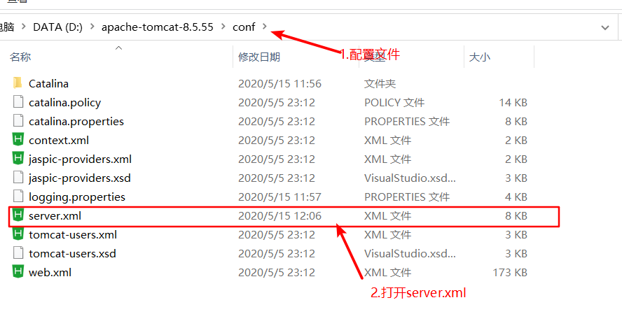
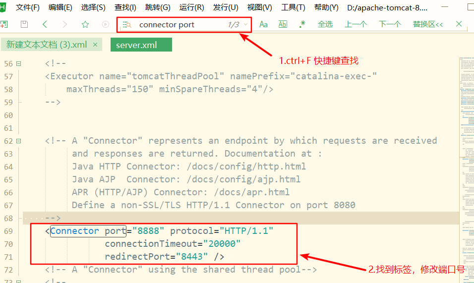
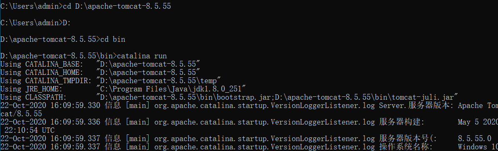

## 1.下载 tomcat

下载链接http://tomcat.apache.org/

## 2.配置环境变量

Tomcat 服务器和 Servlet 版本对应的关系

| Tomcat 版本 | Servlet/JSP 版本 | JavaEE 版本 | 运行环境 |
| ----------- | ---------------- | ----------- | -------- |
| 4.1         | 2.3/1.2          | 1.3         | JDK1.3   |
| 5.0         | 2.4/2.0          | 1.4         | JDK1.4   |
| 5.5/6.0     | 2.5/2.1          | 5.0         | JDK5.0   |
| 7.0         | 3.0/2.2          | 6.0         | JDK6.0   |
| 8.0         | 3.1/2.3          | 7.0         | JDK7.0   |

新建 CATALINA_HOME 环境变量

```
 D:\tomcat\apache-tomcat-8.5.38
```

新建 CATALINA_BASE 环境变量，

```
D:\tomcat\apache-tomcat-8.5.38
```

修改 Path ，在 Path 后添加

```
;%CATALINA_HOME%\lib;%CATALINA_HOME%\bin;
```

## 3.Tomcat 使用

常见错误： 可能与其他服务的端口号冲突
tomcat 端口号默认 8080 （此端口号较为常见，容易冲突），建议修改此端口 （8888）

修改端口号：

1.找到 Tomcat 配置文件



2.修改 Tomcat 配置文件



3.访问 tomcat

两种方式

1. 双击 bin/startup.bat 启动 Tomcat


2. windows 管理提示符

window 键+R 输入 cmd



```
http://localhost:8888/
```

## 4.相关术语介绍


## 5.Tomcat 结构目录


`bin`:可执行文件（startup.bat shutdown.bat）
`conf`:配置文件（server.xml）

- `server.xml`该文件用于配置 server 相关的信息，比如 tomcat 启动的端口号，配置主机(Host)

- `web.xml`文件配置与 web 应用（web 应用相当于一个 web 站点）

- `tomcat-user.xml`配置用户名密码和相关权限.

`lib`：tomcat 依赖的 jar 文件
`log`:日志文件（记录出错等信息）
`temp`:临时文件
`webapps`：可执行的项目（将我们开发的项目 放入该目录）
**work:存放由 jsp 翻译成的 java,以及编辑成的 class 文件(jsp ->java ->class)**

### 5.1webapps 目录的详细说明

在 webapps 中建立了 web1 目录，下面放置我们的 html 文件，jsp 文件，图片等等，则**web1 就被当做 web 应用管理起来【tomcat6.0 以后的版本才支持】**
例子：在**webapps 下创建一个 web 站点，在 web 站点下创建一个 html 文件，访问 html 文件**


### 5.2web 站点的目录是有规范的


为什么要这样设置 web 站点目录呢？

- 需求：我有多个 html 文件，想把其中的一个 html 文件作为我 web 站点的首页。
- 如果没有 WEB-INF 目录下的 web.xml 文件支持，是无法解决我的需求的
- 这个规范是约定熟成的。
  下面将 web 站点下的 helloword2.xml 文件作为站点的首页，新建一个 WEB-INF 目录


在 WEB-INF 目录下创建一个 web.xml


web.xml 我们不可能会写，所以可以在 webapps 目录下其他的站点中抄一份过来【复制 ROOT/WEB-INF/web.xml 的文件到自己的站点中】
在 web.xml 中添加以下代码

```xml
<welcome-file-list>
  <welcome-file>helloword2.html</welcome-file>
</welcome-file-list>
```


访问 web 站点【helloword2.html 已经是 web 站点的首页了，所以不需要指定资源访问了】


