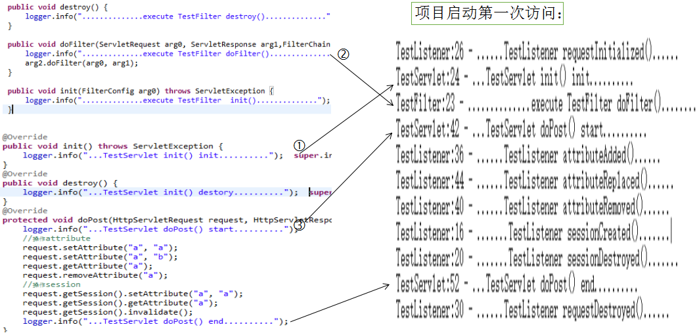
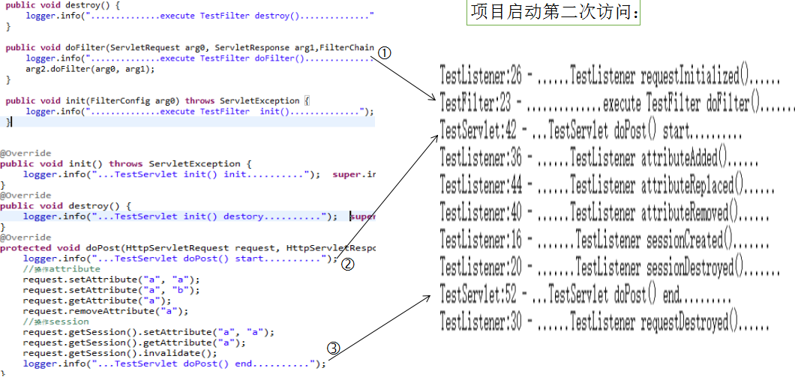

```java
package com.xy.web.listener;
        import javax.servlet.ServletRequestAttributeEvent;

        import javax.servlet.ServletRequestAttributeListener;

        import javax.servlet.ServletRequestEvent;

        import javax.servlet.ServletRequestListener;

        import javax.servlet.http.HttpSessionEvent;

        import javax.servlet.http.HttpSessionListener;

        import org.slf4j.Logger;

        import org.slf4j.LoggerFactory;

public class TestListener implements HttpSessionListener, ServletRequestListener, ServletRequestAttributeListener {


    private Logger logger = LoggerFactory.getLogger(TestListener.class);

    //sessionListener start!

    public void sessionCreated(HttpSessionEvent arg0) {

        logger.info(".......TestListener sessionCreated().......");

    }

    public void sessionDestroyed(HttpSessionEvent arg0) {

        logger.info(".......TestListener sessionDestroyed().......");

    }

    //sessionListener end!

    //requestListener start!

    public void requestInitialized(ServletRequestEvent arg0) {

        logger.info("......TestListener requestInitialized()......");

    }

    public void requestDestroyed(ServletRequestEvent arg0) {

        logger.info("......TestListener requestDestroyed()......");

    }

    //requestListener end!

    //attributeListener start!

    public void attributeAdded(ServletRequestAttributeEvent srae) {

        logger.info("......TestListener attributeAdded()......");

    }

    public void attributeRemoved(ServletRequestAttributeEvent srae) {


        logger.info("......TestListener attributeRemoved()......");

    }

    public void attributeReplaced(ServletRequestAttributeEvent srae) {
        logger.info("......TestListener attributeReplaced()......");
    }
    //attributeListener end!

}
```

Listener,Filter 和 servlet 都是配置在 web.xml 文件中。

## Listener、Filter、Servlet 定义：

## Listener:

首先定义一个 Listener，实现以下接口：

**HttpSessionListener(用来监控 session 的创建，销毁等)
**

**ServletRequestListener(用于监控 servlet 上下文 request)
**

**ServletRequestAttributeListener(用于监控 request 中的 attribute 的操作)**

```java
package com.xy.web.listener;

import javax.servlet.ServletRequestAttributeEvent;

import javax.servlet.ServletRequestAttributeListener;

import javax.servlet.ServletRequestEvent;

import javax.servlet.ServletRequestListener;

import javax.servlet.http.HttpSessionEvent;

import javax.servlet.http.HttpSessionListener;

import org.slf4j.Logger;

import org.slf4j.LoggerFactory;

public class TestListener implements HttpSessionListener,ServletRequestListener,ServletRequestAttributeListener {

    private Logger logger = LoggerFactory.getLogger(TestListener.class);

    //sessionListener start!

    public void sessionCreated(HttpSessionEvent arg0) {

        logger.info(".......TestListener sessionCreated().......");

    }

    public void sessionDestroyed(HttpSessionEvent arg0) {

        logger.info(".......TestListener sessionDestroyed().......");

    }

    //sessionListener end!
    //requestListener start!

    public void requestInitialized(ServletRequestEvent arg0) {

        logger.info("......TestListener requestInitialized()......");

    }

    public void requestDestroyed(ServletRequestEvent arg0) {

        logger.info("......TestListener requestDestroyed()......");

    }

    //requestListener end!
    //attributeListener start!

    public void attributeAdded(ServletRequestAttributeEvent srae) {
        logger.info("......TestListener attributeAdded()......");
    }
    public void attributeRemoved(ServletRequestAttributeEvent srae) {


        logger.info("......TestListener attributeRemoved()......");

    }

    public void attributeReplaced(ServletRequestAttributeEvent srae) {
        logger.info("......TestListener attributeReplaced()......");

    }

    //attributeListener end!

}
```

## Filter：

```java
package com.xy.web.filter;

import java.io.IOException;

import javax.servlet.Filter;

import javax.servlet.FilterChain;

import javax.servlet.FilterConfig;

import javax.servlet.ServletException;

import javax.servlet.ServletRequest;

import javax.servlet.ServletResponse;

import org.slf4j.Logger;

import org.slf4j.LoggerFactory;

public class TestFilter implements Filter {

	private Logger logger = LoggerFactory.getLogger(TestFilter.class);

	public void destroy() {

		logger.info("..............execute TestFilter destory()..............");

	}

	public void doFilter(ServletRequest arg0, ServletResponse arg1,FilterChain arg2) throws IOException, ServletException {

		logger.info("..............execute TestFilter doFilter()..............");

		arg2.doFilter(arg0, arg1);

	}

	public void init(FilterConfig arg0) throws ServletException {

		logger.info("..............execute TestFilter  init()..............");
	}
}
```

## Servlet：

```java
package com.xy.web.servlet;

import java.io.IOException;

import javax.servlet.ServletException;

import javax.servlet.http.HttpServlet;

import javax.servlet.http.HttpServletRequest;

import javax.servlet.http.HttpServletResponse;

import org.slf4j.Logger;

import org.slf4j.LoggerFactory;

public class TestServlet extends HttpServlet {
	private Logger logger = LoggerFactory.getLogger(TestServlet.class);

	/**
	 *
	 */

	private static final long serialVersionUID = -4263672728918819141L;

	@Override

	public void init() throws ServletException {

		logger.info("...TestServlet init() init..........");

		super.init();

	}
	@Override
	public void destroy() {

		logger.info("...TestServlet init() destory..........");
		super.destroy();
	}
	@Override
	protected void doGet(HttpServletRequest req, HttpServletResponse resp)

			throws ServletException, IOException {

		this.doPost(req, resp);

	}

	@Override

	protected void doPost(HttpServletRequest request, HttpServletResponse response)

			throws ServletException, IOException {

		logger.info("...TestServlet doPost() start..........");

		//操作attribute

		request.setAttribute("a", "a");

		request.setAttribute("a", "b");

		request.getAttribute("a");

		request.removeAttribute("a");

		//操作session

		request.getSession().setAttribute("a", "a");

		request.getSession().getAttribute("a");

		request.getSession().invalidate();

		logger.info("...TestServlet doPost() end..........");

	}


}
```

## 配置 XML：

```html
<!-- 测试filter -->

<filter>
  <filter-name>TestFilter</filter-name>

  <filter-class>com.xy.web.filter.TestFilter</filter-class>
</filter>

<filter-mapping>
  <filter-name>TestFilter</filter-name>

  <url-pattern>*.do</url-pattern>
</filter-mapping>

<!-- 测试servlet -->

<servlet>
  <servlet-name>TestServlet</servlet-name>

  <servlet-class>com.xy.web.servlet.TestServlet</servlet-class>
</servlet>

<servlet-mapping>
  <servlet-name>TestServlet</servlet-name>

  <url-pattern>/*</url-pattern>
</servlet-mapping>

<!-- 测试listener -->

<listener>
  <listener-class>com.xy.web.listener.TestListener</listener-class>
</listener>
```

配置好以后启动项目。

## 加载顺序：

### 日志：

查看启动日志如下：

```
信息: Initializing Coyote HTTP/1.1 on http-80

............

2016-1-14 0:47:04 org.apache.catalina.core.ApplicationContext log \***信息: ContextListener: contextInitialized()
2016-1-14 0:47:04 org.apache.catalina.core.ApplicationContext log
信息: SessionListener: contextInitialized()\***

...........

**2016-01-14 00:47:23,369 INFO TestFilter:28 - ..............execute TestFilter init().............**.
2016-1-14 0:47:23 org.apache.catalina.core.ApplicationContext log
**信息: Initializing Spring FrameworkServlet 'spring'**

...........

2016-1-14 0:47:25 org.apache.catalina.startup.Catalina start
信息: Server startup in 21565 ms
```

---

### 结论：

**从启动日志来看，**

**启动的顺序为 listener->Filter->servlet.**

**简单记为：理(Listener)发(Filter)师(servlet).**

**执行的顺序不会因为三个标签在配置文件中的先后顺序而改变。**

## 生命周期：

### 日志：

访问项目路径：http://localhost/MyWebProject/common/test.do，访问 action 两次，打断点后查看日志情况：

第一次访问：

```
2016-01-14 00:03:03,991 INFO TestListener:26 - ......TestListener requestInitialized()......
2016-01-14 00:03:04,001 INFO TestServlet:24 - ...TestServlet init() init..........
2016-01-14 00:03:04,011 INFO TestFilter:23 - ..............execute TestFilter doFilter()..............
2016-01-14 00:03:15,275 INFO TestServlet:42 - ...TestServlet doPost() start..........
2016-01-14 00:03:16,255 INFO TestListener:36 - ......TestListener attributeAdded()......
2016-01-14 00:03:16,853 INFO TestListener:44 - ......TestListener attributeReplaced()......
2016-01-14 00:03:18,561 INFO TestListener:40 - ......TestListener attributeRemoved()......
2016-01-14 00:03:20,065 INFO TestListener:16 - .......TestListener sessionCreated().......
2016-01-14 00:03:22,908 INFO TestListener:20 - .......TestListener sessionDestroyed().......
2016-01-14 00:03:25,624 INFO TestServlet:52 - ...TestServlet doPost() end..........
2016-01-14 00:03:27,746 INFO TestListener:30 - ......TestListener requestDestroyed()......
```



第二次访问：

```
2016-01-14 00:04:08,908 INFO TestListener:26 - ......TestListener requestInitialized()......
2016-01-14 00:04:08,909 INFO TestFilter:23 - ..............execute TestFilter doFilter()..............
2016-01-14 00:04:14,385 INFO TestServlet:42 - ...TestServlet doPost() start..........
2016-01-14 00:04:14,778 INFO TestListener:36 - ......TestListener attributeAdded()......
2016-01-14 00:04:14,974 INFO TestListener:44 - ......TestListener attributeReplaced()......
2016-01-14 00:04:15,342 INFO TestListener:40 - ......TestListener attributeRemoved()......
2016-01-14 00:04:15,904 INFO TestListener:16 - .......TestListener sessionCreated().......
2016-01-14 00:04:17,354 INFO TestListener:20 - .......TestListener sessionDestroyed().......
2016-01-14 00:04:17,815 INFO TestServlet:52 - ...TestServlet doPost() end..........
2016-01-14 00:04:19,044 INFO TestListener:30 - ......TestListener requestDestroyed()......
```



关闭项目，打印日志如下：

```
2016-1-14 0:40:15 org.apache.coyote.http11.Http11Protocol pause
信息: Pausing Coyote HTTP/1.1 on http-80
2016-1-14 0:40:16 org.apache.catalina.core.StandardService stop
信息: Stopping service Catalina
**2016-1-14 0:40:16 org.apache.catalina.core.ApplicationContext log
信息: SessionListener: contextDestroyed()
2016-1-14 0:40:16 org.apache.catalina.core.ApplicationContext log
信息: ContextListener: contextDestroyed()**
**2016-01-14 00:40:16,561 INFO TestServlet:30 - ...TestServlet init() destory..........**
.......
**2016-01-14 00:40:22,091 INFO TestFilter:19 - ..............execute TestFilter destroy()..............**
```

---

### 结论：

从启动，结束和运行时候的日志看：

**Listener 生命周期：一直从程序启动到程序停止运行。**

**ServletRequestListener：每次访问一个 Request 资源前，都会执行 requestInitialized()方法，方法访问完毕，都会执行 requestDestroyed()方法。**

**HttpSessionListener：每次调用 request.getSession()，都会执行 sessionCreated()方法，执行 session.invalidate()方法，都会执行 sessionDestroyed()方法。**

**ServletRequestAttributeListener：每次调用 request.setAttribute()都会执行 attributeAdded()方法，如果 set 的 key 在 request 里面存在，就会执行 attributeReplacerd()方法，调用 request.removeAttribute()方法，都会执行 attributeRemoved()方法。**

**Filter 生命周期：程序启动调用 Filter 的 init()方法**(永远只调用一次,具体看启动日志)**，程序停止调用 Filter 的 destroy()方法**(永远只调用一次，具体看关闭日志)**，doFilter()方法每次的访问请求如果符合拦截条件都会调用**(程序第一次运行，会在 servlet 调用 init()方法以后调用，不管第几次，都在调用 doGet(),doPost()方法之前)

**Servlet 生命周期：程序第一次访问，会调用 servlet 的 init()方法初始化(只执行一次，具体看日志)，每次程序执行都会根据请求调用 doGet()或者 doPost()方法，程序停止调用 destory()方法(具体看结束日志)。
**
