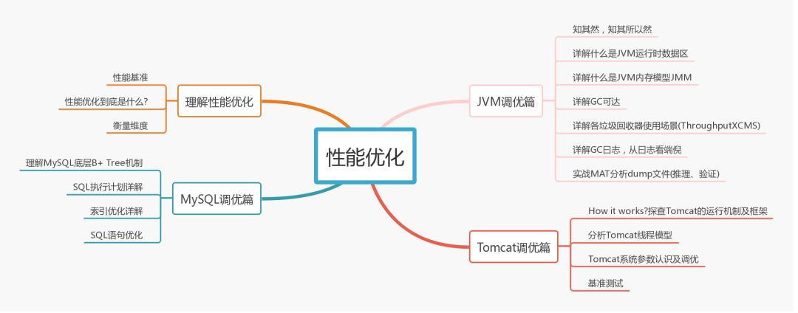

## 一：常见模式与工具

学习 Java 技术体系，设计模式，流行的框架与组件

—— 常见的设计模式，编码必备， Spring5，做应用必不可少的最新框架，MyBatis，玩数据库必不可少的组件......

## 二：工程化与工具

工欲善其事必先利其器，不管是小白，还是资深开发，玩 Java 技术体系，选择好的工具，提升开发效率和团队协作效率，是必不可少的：

**Maven，项目管理**

**Jenkins，持续集成**

**Sonar，代码质量管理**

**Git，版本管理**

## 三：分布式架构

高并发，高可用，海量数据，没有分布式的架构知识肯定是玩不转的：

**分布式架构原理**

**分布式架构策略**

**分布式中间件**

**分布式架构实战**

## 四：微服务架构

业务越来越复杂，服务分层，微服务架构是架构升级的必由之路，Java 技术体系，和微服务相关的技术有哪些呢？

**微服务框架**

**Spring Cloud**

**Docker 与虚拟化**

**微服务架构**

## 五：性能优化

任何脱离细节的 ppt 架构师都是耍流氓，向上能运筹帷幄，向下能解决一线性能问题，Java 技术体系，需要了解：

**性能指标体系**

**JVM 调优**

**Web 调优**

**DB 调优**

## 六：底层知识

从架构设计，到应用层调优，再深入了解底层原理，扎实的 Java 基本功才能让自己变为扫地神僧：

**内存模型**

**并发模式**

**线程模型**

**锁细节**

## 七：项目实战

无需赘述，如果没有实战经验，如何成为一名架构师？

