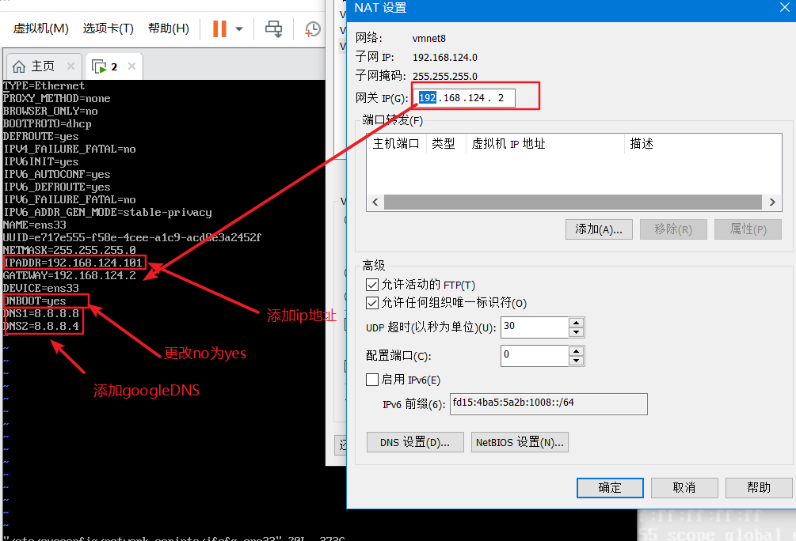
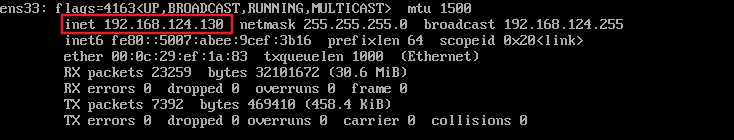
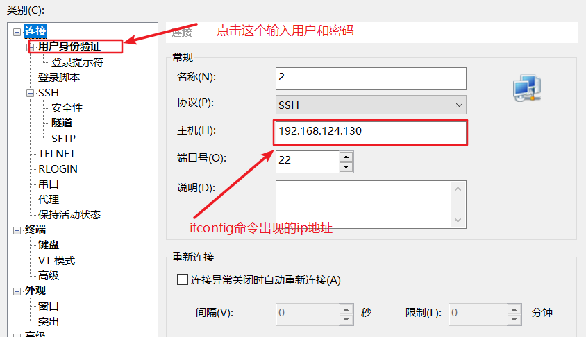

## 测试网络是否连通

ping www.baidu.com

更改网络配置

```bash
vi /etc/sysconfig/network-scripts/ifcfg-ens33
```



ping www.baidu.com

日常命令

wget

```bash
yum install wget
```

更改 yum 仓库

```bash
wget -O /etc/yum.repos.d/CentOS-Base.repo http://mirrors.aliyun.com/repo/Centos-7.repo
```

ifconfig

```bash
yum install net-tools
```

vim

```bash
yum install vim
```

## X-shell 连接虚拟机

### 1.先启动 ssh 没有 ssh 进行安装

安装 ssh

```bash
yum install openssh-server
```

启动 ssh

```bash
service start ssh
```

停止 ssh

```bash
service stop ssh
```

### 2.ifconfig 查看 IP 地址



### x-shell 根据 ip 和用户密码进行连接


