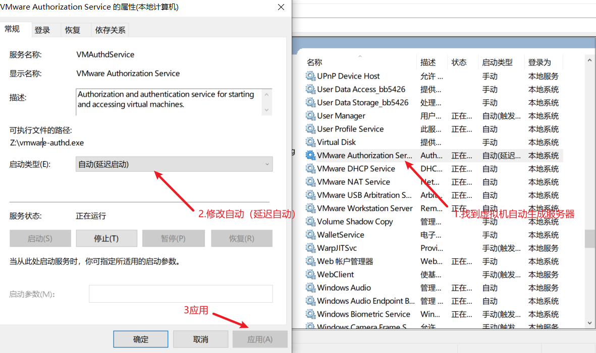

## 一.无法获取 vmci 驱动程序版本： 句柄无效

解决方法：找到虚拟机的配置文件，修改参数 vmci0.present

vmci0.present="TRUE" 代码，将 true 更改为 false 点击保存

_1.找到配置文件_

例如：

- 

_2.修改参数_

vmci0.present="TRUE" 代码，将 true 更改为 false 点击保存


## 二.如果该虚拟机未在使用，请按“获取所有权(T)”按钮获取它的所有权。否则，请按“取消(C)”按钮以防损坏。

找到安装目录删除文件名.vmx.lck 的文件夹，将其改名或者删除。


**三.VMware Workstation 无法连接到虚拟机。请确保您有权运行该程序、访问该程序使用的所有目录以及访问所有临时文件目录。**

###### 1.找到“服务”功能


###### 2.找到 VMware Authorization Service 修改设置。



###### 3.可以重启电脑或者关机重新开机，直接打开虚拟机试试。

###### 注:每次虚拟机不用的时候要 挂起！！！不要关机！！！

**四.用户不在这 sudoers file This incident will be reported**

```
cat /etc/sudoers
```

查看 etc 中 sudoers 的文件内容，etc（linux 系统配置文件）.

```
sudo vim /etc/sudoers
```

使用 vim 编辑器修改 sudoers 将 root 权限那行与用户名一致。


i 编辑 o 空出一行

shift+“:”键 wq 退出 wq！强制退出

## 三、解决 centos 无法使用 service 指令

首先检查自己是否 使用的是 root 用户

在 centos 系统中，如果/sbin 目录下没有 service 这个命令，就会出现

bash: service: command not found
解决步骤如下：
1、 输入

```
yum list | grep initscripts
```

2、 上面给出了可安装软件的 yum 源版本，然后执行

```
yum install initscripts -y
```

3、 此时 service 命令就可用了

## 四、需要最高权限


解决方式：


